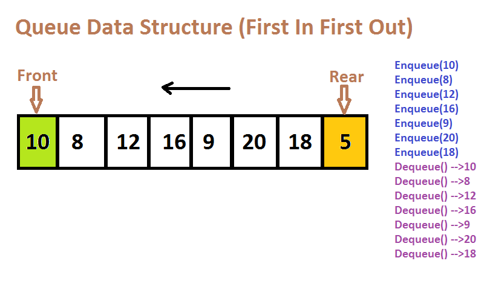
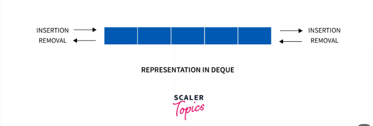

1. J calculate is done inside the while condition but outside the if condition
2. Remove the i calculation from the window before moving to next window i.e *i++* and *j++*.
 


## Queue
 A queue is a data structure that follows the FIFO policy (First in first out) , that is, whatever comes first will go out first. In a queue, the data is inserted from one end which is called as the rear end or tail, whereas the data is deleted from another end which is called as the front end or head of the queue.



## Deque (Double Ended Queue)
 A deque in data structure is a linear data structure that does not follow the FIFO rule (First in first out) , that is, in a deque data structure, the data can be inserted and deleted from both front and rear ends. However, in a queue, we may only insert and remove data from one end.



## Questions Related to Sliding Window and Deque

**We are using Deque in MaxSlidingWindow Question**
- Using Deque to maintain a sliding window of data, where the oldest elements are removed as new elements are added.


### Create Deque in JavaScript
Create a deque (double-ended queue) in JavaScript using functions

```javascript
const createDeque = () => {
    const deque = [];

    // Function to add an element to the front of the deque
    const pushFront = (element) => {
        deque.unshift(element);
    };

    // Function to add an element to the back of the deque
    const pushBack = (element) => {
        deque.push(element);
    };

    // Function to remove an element from the front of the deque
    const popFront = () => {
        return deque.shift();
    };

    // Function to remove an element from the back of the deque
    const popBack = () => {
        return deque.pop();
    };

    // Function to get the element at the front of the deque without removing it
    const front = () => {
        return deque[0];
    };

    // Function to get the element at the back of the deque without removing it
    const back = () => {
        return deque[deque.length - 1];
    };

    // Function to get the size of the deque
    const size = () => {
        return deque.length;
    };

    // Function to check if the deque is empty
    const isEmpty = () => {
        return deque.length === 0;
    };

    // Return the public interface of the deque
    return {
        pushFront,
        pushBack,
        popFront,
        popBack,
        front,
        back,
        size,
        isEmpty
    };
};

// Example usage:
const deque = createDeque();
deque.pushBack(1);
deque.pushBack(2);
deque.pushFront(3);
console.log(deque.popBack()); // Output: 2
console.log(deque.popFront()); // Output: 3
console.log(deque.front()); // Output: 1
console.log(deque.back()); // Output: 1
console.log(deque.size()); // Output: 1
console.log(deque.isEmpty()); // Output: false
```

In this implementation:

- We create a function `createDeque` that initializes an empty array `deque`.
- Inside `createDeque`, we define various functions (`pushFront`, `pushBack`, `popFront`, `popBack`, `front`, `back`, `size`, `isEmpty`) to perform deque operations.
- Each function operates on the `deque` array to perform the corresponding deque operation.
- We return an object containing these functions, which serves as the public interface of the deque. This object allows users to interact with the deque by calling its methods.